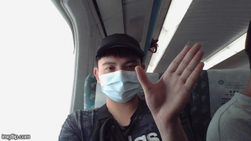

# ET091_08_Gesture

## Model Training
#### 1. Use 20BN Dataset.
#### 2. Filter 6 gesture.
   * Swiping Left
   * Swiping Right
   * Swiping Down 
   * Swiping Up
   * Turning Hand Clockwise
   * Turning Hand Counterclockwise

#### script run
   * Following path [./Model_Training/datasetfilter.ipynb](./Model_Training/datasetfilter.ipynb)

#### 3. Preprocessing
   * Preprocessing Dataset info for training and testing

   * Training Data info Structure
     EX: /GestureDataset/B/TurningHandClockwise/37958/ 36 4
     1. Data Folder Directory:/GestureDataset/B/TurningHandClockwise/37958/
     2. Amount of frames in the folder:36
     3. Class of this folder:4

   * Testing Data info Structure
     EX: /GestureDataset/B/TurningHandClockwise/47908/ 9 4 35
     1. Data Folder Directory:/GestureDataset/B/TurningHandClockwise/47908/
     2. Middle frame index:9
     3. Class of this folder:4
     4. Amount of frames in the folder:35

#### script run
   * Change Path first
     * data_path (Read image data path)
     * out_filename (Store data info path)
   * Following path [./Model_Training/datapreprocessing.ipynb](./Model_Training/datapreprocessing.ipynb)

#### 4. Training

   * "pretrained" Folder include pretrain weight (Sports1M and UCF 101)

   * 5 type model training
       * with different data sampling, data augmentation, training batch, training epochs and network structure.
         1. K_3DCNN_v1
         2. K_3DCNN_v2
         3. K_3DCNN_v3
         4. K_3DCNN_v4
         5. K_3DCNN-svm-xgb
         6. K_3DCNN_v42

#### script run
   * Following path [Model Detail](./Model_Training/readme.md)
#### Stuucture

## Model Testing
1. Different model performance testing
  * A. K_3DCNN_Testing
    * "testdata" is testing data folder
    * "Keras_Model" include a load model package (a class base package include load model and predict method) 
    * Following path [./Model_Testing/K_3DCNN_Testing.ipynb](./Model_Testing/K_3DCNN_Testing.ipynb)
    
  * B. K_3DCNN_Validate
    * Compare different model performance (Include Loss, Accuracy, Precision, Recall, f1-score)
    * 20BN Data validation => '/list/c3d_val001.txt'
    * Real Data validation => '/list/c3d_test005.txt'
    * Following path [./Model_Testing/K_3DCNN_Validate.ipynb](./Model_Testing/K_3DCNN_Validate.ipynb)

## Simple Demo -> Author : 林銘彥 Hugo Lin

1. INFO
  * "model" folder include a model file.
  * "libs" folder include a web browser to youtube player package
  * Follow "requirements.txt" to build  demo code environmental requirement
    * Install Python 3.7.7 at local PC or NB environment instead of using anaconda
    * Build virtual python environment, then follow "requirements.txt" to install package dependency
    * Use CUDA 10.1 and cudnn v7.6.5 

2. DEMO
    1. Simple_Demo
      * Simple demo with webcam capture, model predict and keyboard trigger
      * Following path [Simple_Demo](./Simple_Demo/Simple_Demo.ipynb)

    2. Demo
      * Automatic open web browser and go to youtube player(Press 'S' to start open web browser)
      * Connect between webcam capture, model predict(Press 'P' to start predict)
      * Use model predict result to control web browser to youtube player
      * Following path [Demo](./Simple_Demo/Demo.ipynb)

    3. Demo_M
      * Automatic open web browser and go to youtube player(Press 'S' to start open web browser)
      * Connect between webcam capture, model predict(Press 'P' to start predict)
      * Use model predict result to control web browser to youtube player
      * Following path [Demo_M](./Simple_Demo/Demo_M.ipynb)
      * Use multiple model for prediction 
      
## Hand_Detect_Software -> Author : 蔡明佑
### 以下為軟體操作說明
* 1. Python環境設置
* 2. App 使用說明

### 1. Python環境設置
* 1.0 安裝Python 3.7.x版本
* 1.1 安裝外部模組
  * 1.1.1 請修改Python目錄下install_all_modules.bat中"Python安裝路徑中Script路徑"
  * 1.1.2 請執行Python目錄下install_all_modules.bat
* 1.2 將自訂義的模組"Demo\libs"加入到Python安裝路徑中
  * 1.2.1 請修改cam_demo_lib.pth中自訂義的模組路徑
  * 1.2.2 請複製cam_demo_lib.pth到Python安裝路徑中下的"Lib\site-packages"中
* 1.3 開發專案
  * 1.3.1 請修改open_jupyter_lab.bat中"工作目錄"和"Python安裝路徑中jupyter-lab路徑"
  * 1.3.2 請開啟"Demo\Demo.ipynb"進行修改, 修改完成匯出Demo.py並覆蓋

### 2. App 使用說明
* 2.1 功能
  * 2.1.1 擷取Cam影像進行手勢辨識同時控制youtube 360影片
  * 2.1.2 手勢種類與影片對應
    * 2.1.2.1 左: 影片轉左
    * 2.1.2.2 右: 影片轉右
    * 2.1.2.3 上: 影片轉上
    * 2.1.2.4 下: 影片轉下
    * 2.1.2.5 順時針: 放大影片
    * 2.1.2.6 逆時針: 縮小影片
* 2.2 執行App
  * 2.2.1 請修改main.bat中"工作目錄下Demo路徑"和Python安裝路徑
  * 2.2.2 請執行main.bat
* 2.3 關閉App
  * 2.3.1 點擊鍵盤中"q"鍵
* 2.4 更換youtube 360影片
  * 2.4.1 修改Demo\Demo.py中的youtube_360_video_url變數
* 2.5 如要更換應用
  * 2.5.1 請繼承Demo\libs\desktop_lib.py進行實作
  * 2.5.2 增加Demo\libs\threed_cnn_lib.py中類別Three_D_CNN_Thread的mode變數
  * 2.5.3 修改Demo\Demo.py中threed_cnn_mode變數
      

      
## 20BN Gesture
##### Swiping Left
 
##### Swiping Right

##### Swiping Down

##### Swiping Up

##### Turning Hand Clockwise

##### Turning Hand Counterclockwise

## Testing Gesture
##### Swiping Left
 
##### Swiping Right

##### Swiping Down

##### Swiping Up

##### Turning Hand Clockwise

##### Turning Hand Counterclockwise

## Model Difference
* 前、中、後 => 各資料夾 Frame 總數的 1/4、1/2、3/4 索引值為基準，各向前、後取得連續 8 Frames，構成總數為 16 Frames的訓練輸入資料
* A、N => 各資料夾最前與最後 Frame 重複取6次，再向後與向前取得連續 10 Frames，構成總數為 16 Frames的訓練輸入資料
* 中2 => 各資料夾 Frame 總數的 1/2 索引值為基準，向前、後推進 16 個索引值，向前 16 個索引值為起始值，向後 16 個索引值為終止值，每間隔一個索引值取一個 Frame，構成總數為 16 Frames的訓練輸入資料
* C7 => 7 Class(include one shuffle frames)
* C6 => 6 Class(6 Geature)

| Model  | batch  | Epochs | Train and Valid Data          | Option                                                                             | .h5 file                                     |
| ------ |:------:|:------:|:-----------------------------:|:----------------------------------------------------------------------------------:|:--------------------------------------------:|
| 1      | 32     | 50     | (9600+2400)x3(前、中、後)      | X                                                                                  | basic_model-best-model.h5                    |
| 2      | 32     | 20     | (9600+2400)x3(前、中、後)      | X                                                                                  | basic_model-best-model-rlf.h5                |
| 3      | 32     | 30     | (9600+2400)x3(前、中、後)      | X                                                                                  | basic_model-best-model-2020-10-08_17-28-03.h5|
| 4      | 32     | 30     | (9600+2400)x5(A、前、中、後、N)| Add drop between Conv3a to Conv3b and Conv4a to Conv4b, FC6 and FC7 add L1, L2     | basic_model-best-model-2020-10-09_20-11-11.h5|
| 5      | 32     | 30     | (9600+2400)x5(A、前、中、後、N)| Add drop between Conv3a to Conv3b and Conv4a to Conv4b, FC6 and FC7 add L1, L2     | basic_model-best-model-2020-10-11_16-41-12.h5| 
| 6      | 32     | 50     | (9600+2400)x5(A、前、中、後、N)| Add drop between Conv3a to Conv3b and Conv4a to Conv4b, FC6 and FC7 add L1, L2     | basic_model-best-model-2020-10-12_20-28-06.h5| 
| 7      | 64     | 30     | (9600+2400)x5(A、前、中、後、N)| Add drop between Conv3a to Conv3b and Conv4a to Conv4b, FC6 and FC7 add L1, L2     | basic_model-best-model-2020-10-16_10-10-14.h5| 
| 8      | 32     | 30     | (9600+2400)x5(A、前、中、後、N)| Add drop between Conv4b to Conv5a and Conv5a to Conv5b, FC6 and FC7 add L1, L2     | basic_model-best-model-2020-10-18_00-57-57.h5|   

| Model|Batch|Epochs| Train and Valid Data          | Option                                                                            | .h5 file                                     |
| ---- |:---:|:----:|:-----------------------------:|:---------------------------------------------------------------------------------:|:--------------------------------------------:|
| 1(C7)| 32  | 30   |(11200+2800)x3 (前、中、後)     | 1. Right-left, Up-Down flip. 2.dropout at Conv3a-3b, Conv4a4b. FC6-FC7 add L1, L2 | basic_model-best-model-2020-10-24_21-50-57.h5|
| 2(C7)| 32  | 30   |(11200+2800)x3 (前、中、後)     | 1. Right-left, Up-Down flip. 2.dropout at Conv3a-3b, Conv4a4b. FC6-FC7 add L1, L2 | basic_model-best-model-2020-10-25_09-31-51.h5|
| 3(C6)| 32  | 30   |(9600+2400)x5(A、前、中2、後、N)| 1. Right-left, Up-Down flip. 2.dropout at Conv3a-3b, Conv4a4b. FC6-FC7 add L1, L2 | basic_model-best-model-2020-10-25_20-11-36.h5|
| 4(C7)| 32  | 30   |(11200+2800)x3 (前、中、後) Gray| 1. Right-left, Up-Down flip. 2.dropout at Conv3a-3b, Conv4a-4b. FC6-FC7 add L1, L2| basic_model-best-model-2020-10-26_14-19-30.h5|
| 5(C7)| 32  | 30   |(11200+2800)x3(前、中2、後)     | 1. Right-left, Up-Down flip. 2.dropout at Conv3a-3b, Conv4a-4b. FC6-FC7 add L1, L2| basic_model-best-model-2020-10-27_07-21-28.h5|
| 6(C7)| 32  | 30   |(11200+2800)x3(前、中2、後) Gray| 1. Right-left, Up-Down flip. 2.dropout at Conv3a-3b, Conv4a-4b. FC6-FC7 add L1, L2| basic_model-best-model-2020-10-27_16-19-10.h5|

## Team Member Assignment of Responsibility

* ET091007 林銘彥
    1. Model reference survey
    2. Implement training model and validatate model 

* ET0910012 陳俊安
    1. Paper 彙整
    2. 簡報與海報製作
    3. Training Dataset 彙整 / Real Testing Data Record

* ET0910021 劉皓瑋
    1. Paper 彙整
    2. 簡報與海報製作
    3. Training Dataset 篩選 / Real Testing Data Record

* ET091023 蔡明佑
    1. Video stream as model input technic survey
    2. Implement model prediction to application 